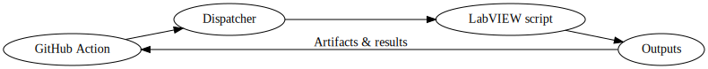
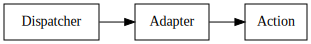

# Architecture

The Open Source LabVIEW Actions project exposes multiple LabVIEW CI/CD steps through a single dispatcher and a set of adapter scripts.

## CI/CD workflow

The GitHub Action triggers the dispatcher, which runs the requested LabVIEW
script and returns artifacts and results back to the action.

## Dispatcher

`Invoke-OSAction.ps1` routes incoming requests to the appropriate adapter script. The dispatcher discovers available actions, forwards command-line arguments, and preserves exit codes.

## Adapter scripts

Each action lives in a `scripts/<action-name>` folder. These PowerShell scripts implement the build or test work and are invoked by the dispatcher with the JSON arguments supplied by the GitHub Action.

## Repository layout

- [`actions/`](../actions/README.md) – dispatcher scripts and PowerShell module
- [`docs/`](index.md) – MkDocs documentation, including this page
- [`scripts/`](../scripts/README.md) – adapter scripts invoked by the dispatcher
- [`tests/`](../tests/README.md) – Pester tests and other verification scripts
- [`tools/`](../tools/README.md) – utilities for building or testing actions
